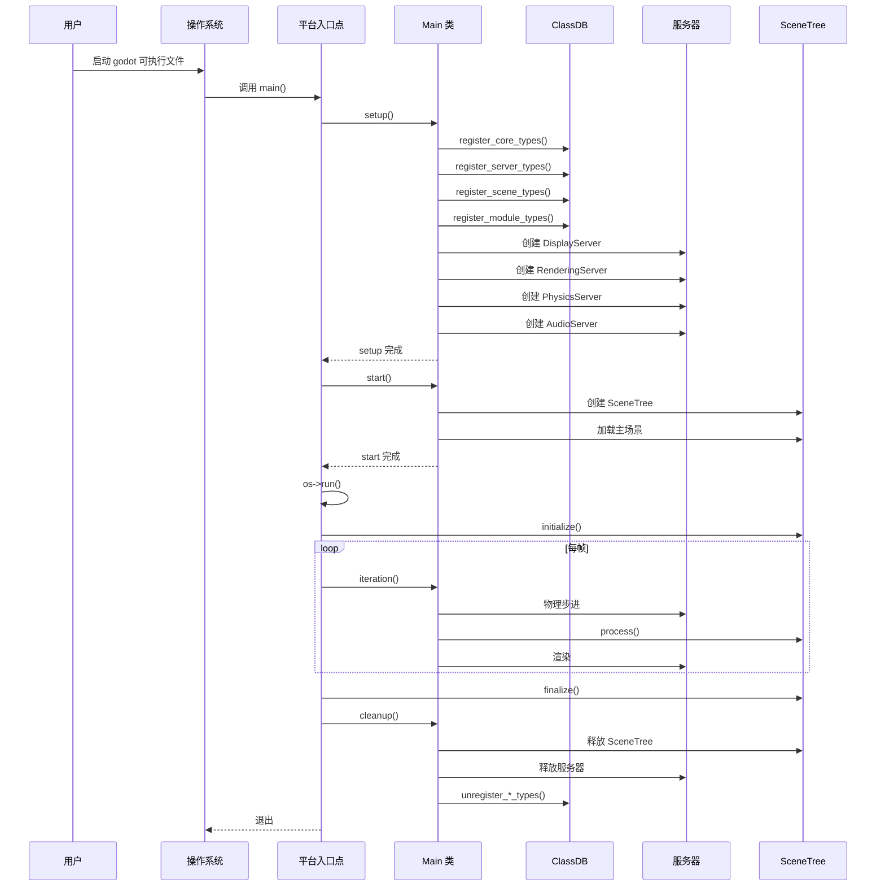

# 03 - Godot 启动流程深度解析

> **源码版本**：Godot 4.8.dev（master 分支，2026-08-26）
> **证据等级**：A（除非另行标注）

---

## 1. 模块概述

Godot 引擎的启动流程是一个精心设计的多阶段过程，从操作系统入口点开始，经过类型注册、服务器创建、主场景加载，最终进入主循环。理解启动流程是理解引擎整体运作的关键——它揭示了 Object、ClassDB、Server、Node 等核心概念如何被初始化并组装成一个可运行的引擎实例。

Godot 的启动分为四个明确的阶段：**setup**（基础初始化）、**start**（业务初始化）、**run**（主循环）、**cleanup**（清理）。每个阶段有明确的职责边界，前一个阶段的输出是后一个阶段的输入。这种分阶段设计使得引擎能够在不同阶段处理不同层级的初始化，确保依赖关系正确。

本章节将从最底层的平台入口点开始，逐层追踪到 SceneTree 的第一帧执行，完整呈现"从 main() 到第一帧"的全过程。

---

## 2. 关键文件清单

> **证据等级 A**：以下文件均基于实际检出验证。

| 文件 | 行数(约) | 职责 |
|------|----------|------|
| `platform/windows/godot_windows.cpp` | ~180 | Windows 平台 WinMain 入口 |
| `platform/linuxbsd/godot_linuxbsd.cpp` | ~150 | Linux 平台 main 入口 |
| `platform/macos/godot_osx.mm` | ~150 | macOS 平台 main 入口 |
| `main/main.cpp` | ~5000 | Main 类：setup/start/iteration/cleanup |
| `main/main.h` | ~100 | Main 类声明 |
| `core/register_core_types.cpp` | ~450 | 核心类型注册 |
| `servers/register_server_types.cpp` | ~200 | 服务器类型注册 |
| `scene/register_scene_types.cpp` | ~500 | 场景类型注册 |
| `modules/register_module_types.cpp` | ~50 | 模块类型注册入口 |
| `core/os/os.h` | ~500 | OS 抽象基类 |
| `core/os/main_loop.h` | ~80 | MainLoop 抽象 |
| `scene/main/scene_tree.h` | ~300 | SceneTree 声明 |

---

## 3. 核心数据结构

### 3.1 启动阶段总览

```
┌─────────────────────────────────────────────────────────────────┐
│                    Godot 启动流程总览                            │
├─────────────────────────────────────────────────────────────────┤
│                                                                 │
│  阶段 1: SETUP（基础初始化）                                     │
│  ┌─────────────────────────────────────────────────────────┐   │
│  │ 1. 创建 OS 单例（平台特定）                               │   │
│  │ 2. 解析命令行参数                                         │   │
│  │ 3. 注册核心类型（register_core_types）                    │   │
│  │ 4. 注册服务器类型（register_server_types）                │   │
│  │ 5. 注册场景类型（register_scene_types）                   │   │
│  │ 6. 注册模块类型（register_module_types）                  │   │
│  │ 7. 创建 DisplayServer                                    │   │
│  │ 8. 创建 RenderingServer                                  │   │
│  │ 9. 创建 PhysicsServer2D/3D                               │   │
│  │ 10. 创建 AudioServer                                     │   │
│  │ 11. 创建 TextServerManager                               │   │
│  │ 12. 加载 ProjectSettings                                 │   │
│  └─────────────────────────────────────────────────────────┘   │
│                          │                                      │
│                          ▼                                      │
│  阶段 2: START（业务初始化）                                     │
│  ┌─────────────────────────────────────────────────────────┐   │
│  │ 1. 创建 InputMap                                         │   │
│  │ 2. 创建 TranslationServer                                │   │
│  │ 3. 加载主包（main_pack）                                 │   │
│  │ 4. 创建 SceneTree（主循环）                               │   │
│  │ 5. 加载主场景（main_scene）                               │   │
│  │ 6. OS::set_main_loop(scene_tree)                         │   │
│  └─────────────────────────────────────────────────────────┘   │
│                          │                                      │
│                          ▼                                      │
│  阶段 3: RUN（主循环）                                           │
│  ┌─────────────────────────────────────────────────────────┐   │
│  │ 1. main_loop->initialize()                               │   │
│  │ 2. while (!exit):                                        │   │
│  │      Main::iteration()                                   │   │
│  │        - 处理事件                                         │   │
│  │        - 物理模拟                                         │   │
│  │        - 场景处理                                         │   │
│  │        - 渲染                                             │   │
│  │ 3. main_loop->finalize()                                 │   │
│  └─────────────────────────────────────────────────────────┘   │
│                          │                                      │
│                          ▼                                      │
│  阶段 4: CLEANUP（清理）                                         │
│  ┌─────────────────────────────────────────────────────────┐   │
│  │ 1. 释放 SceneTree                                        │   │
│  │ 2. 释放所有服务器                                         │   │
│  │ 3. unregister_*_types()                                  │   │
│  │ 4. 销毁 OS 单例                                          │   │
│  └─────────────────────────────────────────────────────────┘   │
│                                                                 │
└─────────────────────────────────────────────────────────────────┘
```

### 3.2 Main 类结构

> **证据等级 A**：基于 `main/main.h` 验证。

```cpp
// main/main.h（简化）
class Main {
    static bool force_quit;
    static OS *os; // 不直接持有，通过 OS::get_singleton()

public:
    static Error setup(const char *execpath, uintptr_t p_instance_id, bool p_second_thread = false);
    static Error start(uintptr_t p_instance_id);
    static bool iteration(double p_time);
    static void cleanup(bool p_force = false);
};
```

Main 是纯静态类，提供四个入口方法，由平台入口点调用。

---

## 4. 核心类与职责

### 4.1 平台入口点

每个平台有自己的入口文件，负责创建 OS 实例并调用 Main 的方法。以 Windows 为例：

> **证据等级 A**：基于 `platform/windows/godot_windows.cpp` 验证。

```cpp
// platform/windows/godot_windows.cpp（简化）
int widechar_main(int argc, wchar_t *argv[]) {
    // 1. 转换参数为 UTF-8
    char **argv_utf8 = ...;

    // 2. 调用 Main::setup
    Error err = Main::setup(argv_utf8[0], GetCurrentProcessId());
    if (err != OK) {
        return 1;
    }

    // 3. 调用 Main::start
    err = Main::start(GetCurrentProcessId());
    if (err != OK) {
        Main::cleanup();
        return 1;
    }

    // 4. 运行主循环
    OS_Windows *os = OS_Windows::get_singleton();
    if (os) {
        os->run();
    }

    // 5. 清理
    Main::cleanup();

    return os ? os->get_exit_code() : 0;
}

int main(int argc, char **argv) {
    // 转换为宽字符
    wchar_t **argv_w = ...;
    return widechar_main(argc, argv_w);
}
```

### 4.2 OS 类

> **证据等级 A**：基于 `core/os/os.h` 验证。

`OS` 是操作系统抽象基类，定义了文件系统、时间、线程、命令行、环境变量等接口。每个平台提供子类（如 `OS_Windows`、`OS_LinuxBSD`、`OS_OSX`）。

关键方法：

- `run()`：运行主循环（调用 main_loop 的 initialize/process/finalize）
- `get_main_loop()` / `set_main_loop()`：管理主循环
- `get_singleton()`：获取单例
- `initialize()` / `finalize()`：平台特定初始化/清理
- `get_data_dir()` / `get_config_dir()`：标准目录

### 4.3 MainLoop 类

> **证据等级 A**：基于 `core/os/main_loop.h` 验证。

```cpp
// core/os/main_loop.h（简化）
class MainLoop : public Object {
    GDCLASS(MainLoop, Object);

public:
    enum Notification {
        NOTIFICATION_OS_MEMORY_WARNING = 2009,
        NOTIFICATION_OS_IME_UPDATE = 2010,
        NOTIFICATION_APPLICATION_RESUMED = 2011,
        NOTIFICATION_APPLICATION_PAUSED = 2012,
        NOTIFICATION_APPLICATION_FOCUS_IN = 2013,
        NOTIFICATION_APPLICATION_FOCUS_OUT = 2014,
        NOTIFICATION_TRANSLATION_CHANGED = 2015,
        NOTIFICATION_WM_ABOUT = 2016,
        NOTIFICATION_CRASH = 2017,
        NOTIFICATION_OS_IME_UPDATE = 2010,
    };

    virtual void initialize() = 0;
    virtual bool process(double delta) = 0;
    virtual bool physics_process(double delta) = 0;
    virtual void finalize() = 0;

    virtual void init() {}
    virtual void pre_delete_handle() {}
    virtual void post_delete_handle() {}
};
```

MainLoop 是主循环的抽象，定义了 initialize/process/physics_process/finalize 四个核心方法。SceneTree 是其具体实现。

### 4.4 SceneTree 类

> **证据等级 A**：基于 `scene/main/scene_tree.h:89` 验证。

SceneTree 继承 MainLoop，是引擎运行时的"世界容器"。它持有根 Window，管理所有节点的树形结构，并驱动每帧的 process/physics_process 调用。

---

## 5. 关键算法与流程

### 5.1 阶段 1：Main::setup() 详解

> **证据等级 A**：基于 `main/main.cpp:3006` 的 `setup` 方法验证。

`Main::setup()` 是启动的第一阶段，负责基础初始化。主要步骤：

```cpp
// main/main.cpp:3006（简化）
Error Main::setup(const char *execpath, uintptr_t p_instance_id, bool p_second_thread) {
    // 1. 创建 OS 单例（平台特定）
    // 在平台入口点已创建，此处获取
    OS *os = OS::get_singleton();

    // 2. 设置启动时间
    os->set_startup_time(OS::get_singleton()->get_ticks_usec());

    // 3. 解析命令行参数
    List<String> args;
    for (int i = 1; i < argc; i++) {
        args.push_back(argv[i]);
    }
    // 解析 --rendering-driver, --audio-driver 等
    // ...

    // 4. 注册核心类型
    register_core_types(); // core/register_core_types.cpp:135

    // 5. 注册服务器类型
    register_server_types(); // servers/register_server_types.cpp:153

    // 6. 注册场景类型
    register_scene_types(); // scene/register_scene_types.cpp:395

    // 7. 注册模块类型
    register_module_types(); // modules/register_module_types.cpp

    // 8. 初始化核心单例
    // - ProjectSettings
    // - InputMap
    // - TranslationServer
    // ...

    // 9. 创建 DisplayServer
    DisplayServer::create(os->get_display_driver_id(), DisplayServer::WindowMode::WINDOW_MODE_WINDOWED, ...);

    // 10. 创建 RenderingServer
    // 根据 --rendering-driver 选择后端（vulkan/gles3）
    RenderingServer::create RenderingServer::get_singleton();

    // 11. 创建 PhysicsServer2D/3D
    PhysicsServer2DManager::get_singleton()->new_server(...);
    PhysicsServer3DManager::get_singleton()->new_server(...);

    // 12. 创建 AudioServer
    AudioServer::get_singleton()->init();

    // 13. 创建 TextServerManager
    TextServerManager::get_singleton();

    // 14. 加载项目设置
    // 查找 project.godot，加载设置
    // ...

    return OK;
}
```

#### 5.1.1 类型注册顺序

> **证据等级 A**：基于各 `register_*_types.cpp` 验证。

类型注册严格按依赖顺序：

```
1. register_core_types()     ← 最先，注册 Object/Variant/ClassDB 等
   ├── GDREGISTER_CLASS(Object)
   ├── GDREGISTER_CLASS(RefCounted)
   ├── GDREGISTER_CLASS(Resource)
   ├── GDREGISTER_CLASS(MainLoop)
   ├── GDREGISTER_CLASS(Image)
   ├── GDREGISTER_CLASS(TranslationServer)
   ├── GDREGISTER_CLASS(InputMap)
   ├── GDREGISTER_CLASS(ProjectSettings)
   └── ...（约 100+ 核心类）

2. register_server_types()   ← 依赖 core
   ├── GDREGISTER_ABSTRACT_CLASS(DisplayServer)
   ├── GDREGISTER_ABSTRACT_CLASS(RenderingServer)
   ├── GDREGISTER_CLASS(AudioServer)
   ├── GDREGISTER_CLASS(TextServerManager)
   ├── GDREGISTER_CLASS(PhysicsServer2DManager)
   ├── GDREGISTER_CLASS(PhysicsServer3DManager)
   └── ...

3. register_scene_types()    ← 依赖 core、servers
   ├── GDREGISTER_CLASS(Node)             ← 依赖 Object
   ├── GDREGISTER_CLASS(CanvasItem)      ← 依赖 Node
   ├── GDREGISTER_CLASS(Node2D)          ← 依赖 CanvasItem
   ├── GDREGISTER_CLASS(Node3D)
   ├── GDREGISTER_CLASS(Control)
   ├── GDREGISTER_CLASS(SceneTree)       ← 依赖 MainLoop、Node
   ├── GDREGISTER_CLASS(Viewport)
   ├── GDREGISTER_CLASS(Window)
   └── ...（约 500+ 场景类）

4. register_module_types()   ← 依赖 core、servers、scene
   ├── initialize_modules(MODULE_INITIALIZATION_LEVEL_CORE)
   ├── initialize_modules(MODULE_INITIALIZATION_LEVEL_SERVERS)
   │   └── GDREGISTER_CLASS(GDScript)    ← GDScript 模块
   ├── initialize_modules(MODULE_INITIALIZATION_LEVEL_SCENE)
   └── initialize_modules(MODULE_INITIALIZATION_LEVEL_EDITOR)
```

#### 5.1.2 服务器创建

> **证据等级 A**：基于 `main/main.cpp` 验证。

服务器创建按特定顺序，确保依赖正确：

```
1. DisplayServer（最先，提供窗口）
   │
   ▼
2. RenderingServer（依赖 DisplayServer 的上下文）
   │
   ▼
3. PhysicsServer2D/3D（独立）
   │
   ▼
4. AudioServer（依赖 DisplayServer 的音频设备）
   │
   ▼
5. TextServerManager（独立）
   │
   ▼
6. NavigationServer（独立）
```

### 5.2 阶段 2：Main::start() 详解

> **证据等级 A**：基于 `main/main.cpp:3974` 的 `start` 方法验证。

`Main::start()` 是启动的第二阶段，负责业务初始化。主要步骤：

```cpp
// main/main.cpp:3974（简化）
Error Main::start(uintptr_t p_instance_id) {
    // 1. 加载主包（如果指定）
    // --main-pack 参数
    // ...

    // 2. 确定主场景路径
    String main_scene = GLOBAL_GET("application/run/main_scene");
    // 例如 "res://main.tscn"

    // 3. 创建 SceneTree（主循环）
    SceneTree *scene_tree = memnew(SceneTree);
    OS::get_singleton()->set_main_loop(scene_tree);

    // 4. 初始化 SceneTree
    scene_tree->initialize();

    // 5. 加载主场景
    if (!main_scene.is_empty()) {
        Ref<PackedScene> scene = ResourceLoader::load(main_scene);
        if (scene.is_valid()) {
            Node *instance = scene->instantiate();
            scene_tree->add_child(instance);
        }
    }

    // 6. 如果是编辑器，启动编辑器
    #ifdef TOOLS_ENABLED
    if (editor) {
        EditorNode *editor_node = memnew(EditorNode);
        scene_tree->get_root()->add_child(editor_node);
    }
    #endif

    return OK;
}
```

#### 5.2.1 SceneTree 创建

> **证据等级 A**：基于 `scene/main/scene_tree.cpp` 验证。

```cpp
// scene/main/scene_tree.cpp（简化）
SceneTree::SceneTree() {
    // 1. 创建根 Window
    root = memnew(Window);
    root->set_name("root");
    root->set_tree(this);

    // 2. 初始化 MessageQueue
    // MessageQueue 是单例，但 SceneTree 持有引用

    // 3. 设置默认进程模式
    // ...
}
```

#### 5.2.2 主场景加载

> **证据等级 A**：基于 `scene/main/scene_tree.cpp` 的 `change_scene` 验证。

```cpp
// 简化的场景加载流程
Error SceneTree::change_scene_to_file(const String &p_path) {
    // 1. 异步加载 PackedScene
    Ref<PackedScene> new_scene = ResourceLoader::load(p_path);
    ERR_FAIL_COND_V(!new_scene.is_valid(), ERR_CANT_OPEN);

    // 2. 延迟切换（避免当前帧迭代中修改）
    current_scene = new_scene->instantiate();
    root->add_child(current_scene);

    return OK;
}
```

### 5.3 阶段 3：OS::run() 主循环

> **证据等级 A**：基于 `platform/windows/os_windows.cpp:2348` 的 `run` 方法验证。

```cpp
// platform/windows/os_windows.cpp:2348（简化）
void OS_Windows::run() {
    // 1. 获取主循环
    MainLoop *main_loop = get_main_loop();
    if (!main_loop) return;

    // 2. 初始化主循环
    main_loop->initialize();

    // 3. 主循环
    bool exit = false;
    uint64_t last_ticks = get_ticks_usec();

    while (!exit) {
        // 3.1 处理系统事件
        DisplayServer::get_singleton()->process_events();

        // 3.2 计算帧时间
        uint64_t current_ticks = get_ticks_usec();
        double frame_time = (current_ticks - last_ticks) / 1000000.0;
        last_ticks = current_ticks;

        // 3.3 调用 Main::iteration
        exit = Main::iteration(frame_time);
    }

    // 4. 清理主循环
    main_loop->finalize();
}
```

#### 5.3.1 Main::iteration() 详解

> **证据等级 A**：基于 `main/main.cpp` 的 `iteration` 方法验证。

```cpp
// main/main.cpp（简化）
bool Main::iteration(double p_time) {
    // 1. 获取主循环
    MainLoop *main_loop = OS::get_singleton()->get_main_loop();

    // 2. 处理物理（固定步长）
    static double time_accumulator = 0;
    time_accumulator += p_time;

    // 物理帧率（默认 60fps）
    double physics_step = 1.0 / Engine::get_singleton()->get_physics_ticks_per_second();
    int physics_frames = 0;
    while (time_accumulator >= physics_step && physics_frames < 8) {
        // 2.1 物理服务器步进
        PhysicsServer2D::get_singleton()->step(physics_step);
        PhysicsServer3D::get_singleton()->step(physics_step);

        // 2.2 场景物理处理
        main_loop->physics_process(physics_step);

        time_accumulator -= physics_step;
        physics_frames++;
    }

    // 3. 场景逻辑处理
    main_loop->process(p_time);

    // 4. 渲染
    RenderingServer::get_singleton()->draw();

    // 5. 音频更新
    AudioServer::get_singleton()->update();

    // 6. 处理 MessageQueue（延迟调用）
    MessageQueue::get_singleton()->flush();

    // 7. 处理延迟删除队列
    // memdelete 延迟的对象
    // ...

    // 8. 检查退出
    if (main_loop->is_quit_on_go_back() && !DisplayServer::get_singleton()->window_can_draw()) {
        return true; // 退出
    }

    return OS::get_singleton()->is_exit_demand();
}
```

#### 5.3.2 SceneTree::process() 详解

> **证据等级 A**：基于 `scene/main/scene_tree.cpp` 验证。

```cpp
// scene/main/scene_tree.cpp（简化）
bool SceneTree::process(double time) {
    // 1. 刷新 MessageQueue（上一帧的延迟调用）
    MessageQueue::get_singleton()->flush();

    // 2. 发送 NOTIFICATION_PROCESS
    _process(false, time); // false = 非物理

    // 3. 处理就绪队列
    _flush_nodes_to_ready();

    // 4. 更新分组
    // ...

    // 5. 渲染前更新
    RenderingServer::get_singleton()->tick();

    return true;
}

void SceneTree::_process(bool p_physics, double p_delta) {
    // 遍历所有需要处理的节点
    SelfList<Node>::List *process_list = p_physics ? &physics_process_list : &process_list_head;

    // 锁定列表（防止迭代中修改）
    _process_lock++;

    for (SelfList<Node> *n = process_list->first(); n; n = n->next()) {
        Node *node = n->self();
        if (node->can_process()) {
            int notification = p_physics ? Node::NOTIFICATION_PHYSICS_PROCESS : Node::NOTIFICATION_PROCESS;
            node->notification(notification);
        }
    }

    _process_lock--;
}
```

### 5.4 阶段 4：Main::cleanup() 详解

> **证据等级 A**：基于 `main/main.cpp:4750` 的 `cleanup` 方法验证。

```cpp
// main/main.cpp:4750（简化）
void Main::cleanup(bool p_force) {
    // 1. 释放主循环（SceneTree）
    if (OS::get_singleton()->get_main_loop()) {
        memdelete(OS::get_singleton()->get_main_loop());
        OS::get_singleton()->set_main_loop(nullptr);
    }

    // 2. 释放服务器
    // - RenderingServer
    // - PhysicsServer2D/3D
    // - AudioServer
    // - DisplayServer
    // - TextServerManager
    // ...

    // 3. 注销类型（逆序）
    unregister_module_types();
    unregister_scene_types();
    unregister_server_types();
    unregister_core_types();

    // 4. 释放核心单例
    // - ProjectSettings
    // - InputMap
    // - TranslationServer
    // ...

    // 5. 销毁 OS 单例
    OS *os = OS::get_singleton();
    os->finalize();
    memdelete(os);
}
```

清理顺序与初始化相反，确保依赖正确释放。

---

## 6. 与其他模块的交互

### 6.1 启动流程涉及的模块

```
platform/          → 提供入口点与 OS 实现
   │
   ▼
main/              → 协调所有层的初始化
   │
   ├── core/       → register_core_types()
   ├── servers/    → register_server_types() + 创建服务器
   ├── scene/      → register_scene_types() + 创建 SceneTree
   └── modules/    → register_module_types()
       │
       ▼
OS::run()          → 驱动主循环
   │
   ▼
SceneTree          → 每帧驱动节点树
```

### 6.2 关键交互点

- **platform ↔ main**：平台入口点调用 Main 的静态方法
- **main ↔ core**：调用 register_core_types 注册核心类型
- **main ↔ servers**：创建并初始化各服务器
- **main ↔ scene**：创建 SceneTree 作为主循环
- **OS ↔ MainLoop**：OS::run() 驱动 MainLoop 的生命周期
- **SceneTree ↔ Node**：SceneTree 每帧驱动 Node 的 process

---

## 7. 内存与生命周期

### 7.1 启动期间创建的对象

| 对象 | 创建位置 | 释放位置 |
|------|----------|----------|
| OS 单例 | 平台入口点 | Main::cleanup() |
| ClassDB 数据 | register_*_types() | unregister_*_types() |
| DisplayServer | Main::setup() | Main::cleanup() |
| RenderingServer | Main::setup() | Main::cleanup() |
| PhysicsServer | Main::setup() | Main::cleanup() |
| AudioServer | Main::setup() | Main::cleanup() |
| SceneTree | Main::start() | Main::cleanup() |
| 主场景节点 | Main::start() | SceneTree 释放时 |

### 7.2 生命周期保证

- **类型注册先于实例化**：所有类在 SceneTree 创建前注册
- **服务器先于场景**：服务器在 SceneTree 创建前就绪
- **SceneTree 先于节点**：SceneTree 创建后才加载场景
- **清理逆序**：先释放场景，再释放服务器，最后注销类型

---

## 8. 线程模型

### 8.1 启动阶段（单线程）

启动的 setup 和 start 阶段在主线程执行，所有初始化串行进行。

### 8.2 主循环阶段

主循环在主线程，但部分服务器有独立线程：

- **PhysicsServer2DWrapMT**：物理模拟在独立线程
- **RenderingServer**：渲染命令提交在主线程，GPU 执行异步
- **AudioServer**：音频混音在独立线程
- **WorkerThreadPool**：通用工作线程池

### 8.3 线程同步

- **MessageQueue**：跨线程调用的延迟执行队列
- **Callable::call_deferred**：延迟到主线程执行
- **PhysicsServer2DWrapMT 的 CommandQueueMT**：物理线程的命令队列

---

## 9. 错误处理与日志

### 9.1 启动错误处理

- `Main::setup()` 失败返回非 OK，平台入口点退出
- `Main::start()` 失败调用 `Main::cleanup()` 后退出
- 服务器创建失败会 `ERR_FAIL`
- 主场景加载失败会警告，但不退出

### 9.2 启动日志

启动过程输出大量日志，可通过 `--verbose` 查看：

```
CORE TYPES
REGISTERED CLASSES: 100+
SERVER TYPES
SCENE TYPES
MODULES LOADED
RENDERING DRIVER: vulkan
PHYSICS DRIVER: default
AUDIO DRIVER: WASAPI
PROJECT LOADED: /path/to/project
MAIN SCENE: res://main.tscn
```

---

## 10. 配置与可扩展性

### 10.1 命令行参数

启动支持大量命令行参数：

- `--rendering-driver vulkan|gles3`：选择渲染后端
- `--audio-driver WASAPI|XAudio2|...`：选择音频后端
- `--physics-driver default|box2d|...`：选择物理后端
- `--main-pack <path>`：指定主包
- `--editor`：启动编辑器
- `--script <path>`：运行脚本
- `--verbose`：详细日志
- `--profiling`：启用性能分析

### 10.2 项目设置

`project.godot` 中的关键启动设置：

```ini
[application]
config/name="My Game"
run/main_scene="res://main.tscn"

[display]
window/size/viewport_width=1152
window/size/viewport_height=648

[rendering]
renderer/rendering_method="forward_plus"
```

### 10.3 扩展点

- **自定义 MainLoop**：通过 `OS::set_main_loop()` 替换（高级用法）
- **自定义服务器**：通过 GDExtension 注册
- **自定义模块**：在 modules/ 添加，通过 register_types.cpp 接入

---

## 11. 性能考量

### 11.1 启动性能

- **类型注册开销**：约 600+ 类的注册，在现代硬件上 <100ms
- **服务器创建开销**：主要在 GPU 上下文创建，约 100-500ms
- **主场景加载**：取决于场景复杂度与资源大小

### 11.2 主循环性能

- **物理步进**：固定步长，默认 60fps，最多 8 步/帧（防止螺旋下降）
- **节点处理**：遍历 process_list，O(n)
- **渲染**：GPU 异步，主线程提交命令
- **MessageQueue**：帧末批量处理，减少调用开销

---

## 12. 调试技巧

### 12.1 启动调试

```bash
# 详细日志
godot --verbose

# 指定渲染后端
godot --rendering-driver gles3

# 运行脚本
godot --script res://test.gd

# 安全模式（禁用插件）
godot --safe-mode
```

### 12.2 启动崩溃排查

- 检查 `--verbose` 日志
- 检查 `project.godot` 的 `main_scene` 是否存在
- 检查 GPU 驱动是否支持所选渲染后端
- 使用 `--rendering-driver gles3` 降级

### 12.3 性能分析

- `--profiling` 启用内置性能分析
- `EngineDebugger` 提供运行时调试接口
- `Performance` 单例提供运行时指标

---

## 13. 常见陷阱

### 13.1 主场景未设置

若 `project.godot` 的 `main_scene` 为空，引擎启动后无场景，窗口黑屏。检查项目设置。

### 13.2 渲染后端不支持

选择不支持的渲染后端（如旧硬件选 Vulkan）会导致启动失败。降级到 gles3。

### 13.3 模块依赖缺失

自定义模块依赖其他模块时，若初始化顺序错误会崩溃。确保 `MODULE_INITIALIZATION_LEVEL` 正确。

### 13.4 资源路径错误

`res://` 路径区分大小写（在 Linux/macOS）。确保路径与文件系统一致。

### 13.5 启动时崩溃

- 检查 GPU 驱动
- 检查系统库依赖（`ldd godot`）
- 尝试 `--safe-mode` 禁用插件
- 查看崩溃日志

---

## 14. 源码阅读建议

### 14.1 推荐阅读顺序

1. **平台入口点**：从 `platform/<your_os>/godot_<os>.cpp` 开始
2. **Main::setup()**：理解基础初始化
3. **register_*_types()**：理解类型注册顺序
4. **Main::start()**：理解 SceneTree 创建
5. **OS::run()**：理解主循环驱动
6. **Main::iteration()**：理解每帧执行
7. **SceneTree::process()**：理解节点处理

### 14.2 实践建议

- 在 `Main::setup()` 添加日志，观察初始化顺序
- 在 `Main::iteration()` 添加帧计数器
- 在 `register_scene_types()` 搜索特定类的注册
- 尝试添加自定义模块，观察初始化时机

### 14.3 关键断点

调试时可在以下位置设断点：

- `Main::setup()`：启动开始
- `register_core_types()`：核心类型注册
- `Main::start()`：业务初始化
- `OS_Windows::run()`：主循环开始
- `Main::iteration()`：每帧
- `SceneTree::process()`：场景处理

---

## 15. 参考与延伸

### 15.1 关键源码索引

| 主题 | 文件 | 行号(约) |
|------|------|----------|
| Windows 入口 | `platform/windows/godot_windows.cpp` | - |
| Main::setup | `main/main.cpp` | 3006 |
| Main::start | `main/main.cpp` | 3974 |
| Main::iteration | `main/main.cpp` | - |
| Main::cleanup | `main/main.cpp` | 4750 |
| OS_Windows::run | `platform/windows/os_windows.cpp` | 2348 |
| register_core_types | `core/register_core_types.cpp` | 135 |
| register_server_types | `servers/register_server_types.cpp` | 153 |
| register_scene_types | `scene/register_scene_types.cpp` | 395 |
| SceneTree 构造 | `scene/main/scene_tree.cpp` | - |

### 15.2 相关文档

- [01-总体架构.md](./01-总体架构.md)：整体架构概览
- [02-核心概念.md](./02-核心概念.md)：Object/ClassDB 等核心概念
- [04-服务器架构.md](./04-服务器架构.md)：服务器创建细节
- [05-调用链案例.md](./05-调用链案例.md)：启动调用链案例
- [07-模块系统与扩展.md](./07-模块系统与扩展.md)：模块初始化机制

### 15.3 启动流程时序图


