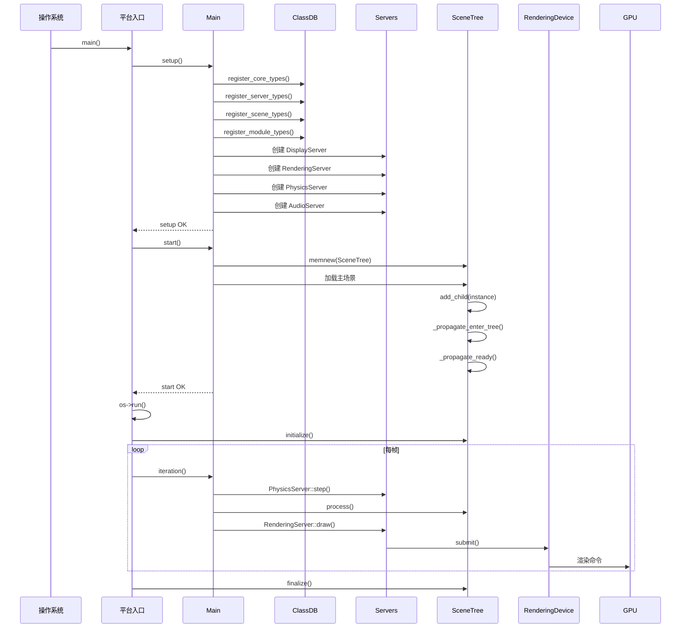

# 05 - 跨层调用链案例追踪

> **源码版本**：Godot 4.8.dev（master 分支，2026-08-26）
> **证据等级**：A（除非另行标注）

---

## 概述

理解 Godot 源码的最佳方式是追踪完整的调用链——从用户代码（GDScript/C#）出发，穿越脚本系统、Object 系统、ClassDB、Server 层，最终到达底层硬件。本章节选取六个典型场景，完整呈现"从用户代码到 CPU"的调用路径。

这六个案例覆盖了 Godot 的核心运作机制：

1. **引擎启动**：从 main() 到第一帧渲染
2. **创建 Node**：从 GDScript `Node.new()` 到 C++ 对象构造
3. **Signal 触发**：从 `emit_signal` 到回调执行
4. **渲染提交**：从 `Sprite2D` 变换到 GPU 绘制
5. **物理模拟**：从 `CharacterBody2D` 移动到碰撞响应
6. **GDScript 调用 C++**：从脚本方法调用到 MethodBind 执行

每个案例都包含调用栈、关键代码、数据流图，帮助读者建立对引擎运作的整体认知。

---

## 案例一：引擎启动到第一帧

### 场景描述

用户运行 `godot` 可执行文件，引擎启动，加载主场景，渲染第一帧。

### 调用栈

```
main(argc, argv)                                    [platform/windows/godot_windows.cpp]
└── widechar_main(argc, argv)
    ├── Main::setup(execpath, instance_id)          [main/main.cpp:3006]
    │   ├── register_core_types()                   [core/register_core_types.cpp:135]
    │   │   ├── GDREGISTER_CLASS(Object)
    │   │   ├── GDREGISTER_CLASS(RefCounted)
    │   │   ├── GDREGISTER_CLASS(Resource)
    │   │   └── ... (100+ 核心类)
    │   ├── register_server_types()                 [servers/register_server_types.cpp:153]
    │   │   ├── GDREGISTER_ABSTRACT_CLASS(RenderingServer)
    │   │   ├── GDREGISTER_ABSTRACT_CLASS(PhysicsServer2D)
    │   │   └── ...
    │   ├── register_scene_types()                  [scene/register_scene_types.cpp:395]
    │   │   ├── GDREGISTER_CLASS(Node)
    │   │   ├── GDREGISTER_CLASS(SceneTree)
    │   │   ├── GDREGISTER_CLASS(CanvasItem)
    │   │   └── ... (500+ 场景类)
    │   ├── register_module_types()                 [modules/register_module_types.cpp]
    │   │   └── initialize_modules(LEVEL_CORE/SERVERS/SCENE/EDITOR)
    │   ├── DisplayServer::create(...)              [servers/display_server.cpp]
    │   ├── RenderingServer::create()               [servers/rendering/rendering_server.cpp]
    │   │   └── memnew(RenderingServerDefault)
    │   │       └── memnew(RenderingDeviceVulkan)   [drivers/vulkan/]
    │   ├── PhysicsServer2DManager::new_server()    [servers/physics_2d/]
    │   └── AudioServer::init()                     [servers/audio_server.cpp]
    │
    ├── Main::start(instance_id)                    [main/main.cpp:3974]
    │   ├── memnew(SceneTree)                       [scene/main/scene_tree.cpp]
    │   │   └── memnew(Window)  // 根窗口
    │   ├── OS::get_singleton()->set_main_loop(scene_tree)
    │   └── ResourceLoader::load("res://main.tscn")
    │       └── PackedScene::instantiate()
    │           └── scene_tree->add_child(instance)
    │               └── Node::_propagate_enter_tree()
    │                   ├── notification(NOTIFICATION_ENTER_TREE)
    │                   └── _propagate_ready()
    │                       └── notification(NOTIFICATION_READY)
    │
    └── os->run()                                   [platform/windows/os_windows.cpp:2348]
        ├── main_loop->initialize()                 // SceneTree::initialize()
        ├── while (!exit):
        │   └── Main::iteration(frame_time)         [main/main.cpp]
        │       ├── PhysicsServer2D::step(delta)
        │       ├── SceneTree::process(time)
        │       │   ├── MessageQueue::flush()
        │       │   ├── _process(false, time)
        │       │   │   └── node->notification(NOTIFICATION_PROCESS)
        │       │   └── _flush_nodes_to_ready()
        │       ├── RenderingServer::draw()
        │       │   └── RenderingMethod::render_scene()
        │       │       └── RenderingDevice::submit()
        │       └── AudioServer::update()
        └── main_loop->finalize()
```

### 数据流图

```
┌─────────────┐     命令行参数      ┌──────────────┐
| 操作系统     │ ──────────────────▶ | 平台入口点    │
└─────────────┘                     └──────┬───────┘
                                           │ 调用
                                           ▼
                                    ┌──────────────┐
                                    | Main::setup  │
                                    └──────┬───────┘
                                           │ 注册类型
                                           ▼
                                    ┌──────────────┐
                                    | ClassDB      │ ─── 600+ 类注册
                                    └──────┬───────┘
                                           │ 创建服务器
                                           ▼
                                    ┌──────────────┐
                                    | Servers      │ ─── Rendering/Physics/Audio
                                    └──────┬───────┘
                                           │ 创建主循环
                                           ▼
                                    ┌──────────────┐
                                    | SceneTree    │ ─── 加载主场景
                                    └──────┬───────┘
                                           │ 运行
                                           ▼
                                    ┌──────────────┐
                                    | OS::run()    │ ─── 主循环
                                    └──────────────┘
```

### 关键代码

#### 1. 类型注册

> **证据等级 A**：基于 `core/register_core_types.cpp:135` 验证。

```cpp
// core/register_core_types.cpp:135
void register_core_types() {
    // 注册核心单例
    GDREGISTER_CLASS(Object);
    GDREGISTER_CLASS(RefCounted);
    GDREGISTER_CLASS(Resource);
    // ... 约 100+ 核心类
}
```

#### 2. SceneTree 创建

> **证据等级 A**：基于 `scene/main/scene_tree.cpp` 验证。

```cpp
// scene/main/scene_tree.cpp（简化）
SceneTree::SceneTree() {
    root = memnew(Window);  // 创建根窗口
    root->set_name("root");
    root->set_tree(this);
}
```

#### 3. 主循环

> **证据等级 A**：基于 `platform/windows/os_windows.cpp:2348` 验证。

```cpp
// platform/windows/os_windows.cpp:2348（简化）
void OS_Windows::run() {
    MainLoop *main_loop = get_main_loop();
    main_loop->initialize();

    bool exit = false;
    while (!exit) {
        DisplayServer::get_singleton()->process_events();
        double frame_time = ...;
        exit = Main::iteration(frame_time);
    }

    main_loop->finalize();
}
```

### 时序图



---

## 案例二：创建 Node

### 场景描述

GDScript 代码 `var node = Node.new()` 创建一个新节点。

### 调用栈

```
GDScript: var node = Node.new()
│
▼
GDScriptLanguage::call_method()                     [modules/gdscript/]
└── GDScriptFunction::call()
    └── 解析 "Node" 与 "new"
        └── ClassDB::instantiate("Node")            [core/object/class_db.cpp]
            └── ClassInfo::creation_func()
                └── Node::create()                  // GDCLASS 宏生成
                    └── memnew(Node)                [core/os/memory.h]
                        ├── malloc(sizeof(Node))
                        ├── Node::Node()            // 构造函数
                        │   └── Object::Object()
                        └── Object::_postinitialize() [core/object/object.cpp:191]
                            └── notification(NOTIFICATION_POSTINITIALIZE)
                                └── _notification_forward(NOTIFICATION_POSTINITIALIZE)
                                    └── Node::_notification() // 若重写
```

### 数据流图

```
GDScript 字节码
    │
    │ "Node.new()"
    ▼
GDScript VM
    │
    │ 查找类 "Node"
    ▼
ClassDB::classes["Node"]
    │
    │ 获取 creation_func
    ▼
Node::create()  (GDCLASS 宏生成)
    │
    │ memnew
    ▼
内存分配 + 构造
    │
    │ _postinitialize
    ▼
NOTIFICATION_POSTINITIALIZE
    │
    ▼
返回 Object* 给 GDScript
    │
    │ 包装为 Variant
    ▼
GDScript 变量 node
```

### 关键代码

#### 1. ClassDB::instantiate

> **证据等级 A**：基于 `core/object/class_db.cpp` 验证。

```cpp
// core/object/class_db.cpp（简化）
Object *ClassDB::instantiate(const StringName &p_class) {
    ClassInfo *info = classes.getptr(p_class);
    ERR_FAIL_NULL_V(info, nullptr);
    ERR_FAIL_COND_V_MSG(info->creation_func == nullptr, nullptr, "Class cannot be instantiated.");
    return info->creation_func(); // 调用 GDCLASS 生成的工厂函数
}
```

#### 2. GDCLASS 宏生成的 create()

> **证据等级 A**：基于 `core/object/object.h:245-294` 验证。

```cpp
// GDCLASS(Node, Object) 展开后（简化）
static Object *create() { return memnew(Node); }
```

#### 3. _postinitialize

> **证据等级 A**：基于 `core/object/object.cpp:191` 验证。

```cpp
// core/object/object.cpp:191
void Object::_postinitialize() {
    notification(NOTIFICATION_POSTINITIALIZE);
}
```

### 关键点

- **GDCLASS 宏**：为每个类生成 `create()` 工厂函数，注册到 ClassDB
- **memnew**：Godot 的 new，分配内存并调用构造函数，然后调用 `_postinitialize`
- **POSTINITIALIZE 通知**：此时虚函数表已就绪，可安全调用虚函数
- **Variant 包装**：Object* 通过 Variant 的 ObjData 返回给脚本

---

## 案例三：Signal 触发

### 场景描述

GDScript 代码 `button.emit("pressed")` 触发按钮的 pressed 信号，连接的回调被调用。

### 调用栈

```
GDScript: button.emit("pressed")
│
▼
GDScriptFunction::call()
└── Object::callp("emit_signal", ["pressed"])      [core/object/object.cpp]
    └── ClassDB::get_method("Object", "emit_signal")
        └── MethodBind::call(this, ["pressed"])
            └── Object::emit_signal("pressed")     // 实际方法
                └── Object::emit_signalp("pressed", nullptr, 0) [core/object/object.cpp:1256]
                    ├── 检查 _block_signals
                    ├── 查找 signal_map["pressed"]
                    ├── ObjectSignalLock lock(this)  // 加锁
                    ├── 复制 slot 列表到栈（≤5）或堆
                    ├── lock.release()               // 解锁
                    └── 遍历 callables:
                        ├── if CONNECT_DEFERRED:
                        │   └── MessageQueue::push_call(callable)
                        │       └── （帧末执行）
                        │           └── callable.callp()
                        │               └── Object::callp(method_name, args)
                        │                   └── ClassDB::get_method(...)
                        │                       └── MethodBind::call()
                        │                           └── 实际 C++ 方法
                        └── else (立即调用):
                            └── callable.callp(nullptr, 0)
                                └── CallableCustom::call()  // 若是 lambda
                                或 Object::callp(method_name)  // 若是对象方法
                                    └── ClassDB::get_method(...)
                                        └── MethodBind::call()
                                            └── 实际 C++ 方法
```

### 数据流图

```
┌──────────────┐
│ GDScript     │ button.emit("pressed")
└──────┬───────┘
       │ callp("emit_signal", ["pressed"])
       ▼
┌──────────────┐
│ Object       │
│ callp()      │
└──────┬───────┘
       │ ClassDB 查找
       ▼
┌──────────────┐
│ MethodBind   │
│ call()       │
└──────┬───────┘
       │ 调用实际方法
       ▼
┌──────────────┐
│ Object       │
│ emit_signalp │
└──────┬───────┘
       │ 查找 signal_map
       ▼
┌──────────────┐
│ SignalData   │
│ slot_map     │ ─── [Callable1, Callable2, ...]
└──────┬───────┘
       │ 遍历调用
       ▼
┌──────────────┐
│ Callable     │
│ callp()      │
└──────┬───────┘
       │
       ├── 立即调用 → Object::callp → MethodBind → C++ 方法
       │
       └── DEFERRED → MessageQueue → 帧末执行
```

### 关键代码

#### 1. emit_signalp 的栈优化

> **证据等级 A**：基于 `core/object/object.cpp:1256` 验证。

```cpp
// core/object/object.cpp:1256（简化）
void Object::emit_signalp(const StringName &p_name, const Variant **p_args, int p_argcount) {
    if (_block_signals) return;

    SignalData *s = signal_map.getptr(p_name);
    if (!s || s->slot_map.is_empty()) return;

    // 栈分配优化：≤5 个连接用栈数组
    constexpr int MAX_SLOTS_ON_STACK = 5;
    alignas(Callable) uint8_t slot_callable_stack[sizeof(Callable) * MAX_SLOTS_ON_STACK];
    uint32_t slot_flags_stack[MAX_SLOTS_ON_STACK];

    int slot_count = s->slot_map.size();
    Callable *callables;
    uint32_t *flags;

    if (slot_count <= MAX_SLOTS_ON_STACK) {
        callables = (Callable *)slot_callable_stack;  // 栈分配
        flags = slot_flags_stack;
    } else {
        callables = (Callable *)memalloc(sizeof(Callable) * slot_count);  // 堆分配
        flags = (uint32_t *)memalloc(sizeof(uint32_t) * slot_count);
    }

    // 复制 slot 数据（加锁）
    {
        ObjectSignalLock lock(this);
        int idx = 0;
        for (const KeyValue<Callable, Slot> &kv : s->slot_map) {
            memnew_placement(&callables[idx], Callable(kv.key));
            flags[idx] = kv.value.conn.flags;
            idx++;
        }
    }

    // 遍历调用（已解锁）
    for (int i = 0; i < slot_count; i++) {
        if (flags[i] & CONNECT_DEFERRED) {
            MessageQueue::get_singleton()->push_call(callables[i], p_args, p_argcount);
        } else {
            Callable::CallError ce;
            callables[i].callp(p_args, p_argcount, ce);
        }
    }

    // 清理
    for (int i = 0; i < slot_count; i++) {
        callables[i].~Callable();
    }
    if (slot_count > MAX_SLOTS_ON_STACK) {
        memfree(callables);
        memfree(flags);
    }
}
```

### 关键点

- **栈分配优化**：≤5 个连接避免堆分配，提升性能
- **复制后调用**：先复制 slot 列表再解锁，避免迭代中修改
- **DEFERRED 延迟**：通过 MessageQueue 在帧末执行
- **Callable 多态**：Callable 可以是对象方法、Lambda、绑定参数

---

## 案例四：渲染提交

### 场景描述

GDScript 代码 `sprite.position = Vector2(100, 100)` 修改精灵位置，最终 GPU 绘制该精灵。

### 调用栈

```
GDScript: sprite.position = Vector2(100, 100)
│
▼
GDScriptFunction::call()
└── Object::callp("set_position", [Vector2(100, 100)])
    └── ClassDB::get_method("Node2D", "set_position")
        └── MethodBind::call(sprite, [Vector2(100, 100)])
            └── Node2D::set_position(Vector2(100, 100))  [scene/2d/node_2d.cpp]
                └── CanvasItem::set_transform(Transform2D(...))
                    └── RenderingServer::canvas_item_set_transform(ci, transform)
                        │   [servers/rendering/rendering_server.cpp]
                        ├── canvas_item_owner.get_or_null(ci) → CanvasItem*
                        └── ci->transform = transform  // 更新内部数据
                        （此时未渲染，仅更新数据）

# --- 帧末渲染 ---

Main::iteration()
└── RenderingServer::draw()
    └── RenderingServerDefault::draw()
        ├── 更新场景图（_instance_dependency_queue）
        └── RenderingMethod::render_scene(viewport, ...)
            └── RendererCanvasRenderRD::render_canvas(canvas, ...)
                ├── 遍历 canvas 的 items
                ├── 对每个 CanvasItem：
                │   ├── 收集绘制命令（rect、texture_rect 等）
                │   └── 生成顶点数据
                ├── 批处理（合批优化）
                └── RenderingDevice::draw_list_begin() / draw_list_bind_render_pipeline() / draw_list_bind_vertex_array() / draw_list_draw()
                    └── RenderingDeviceVulkan::draw_list_draw()
                        └── vkCmdDraw()  // Vulkan API 调用
                            └── GPU 执行绘制命令
```

### 数据流图

```
┌──────────────┐
│ GDScript     │ sprite.position = Vector2(100, 100)
└──────┬───────┘
       │ set_position
       ▼
┌──────────────┐
│ Node2D       │
│ set_position │
└──────┬───────┘
       │ 持有 RID ci
       ▼
┌──────────────┐
│RenderingServer│
│canvas_item_  │
│set_transform │
└──────┬───────┘
       │ RID → CanvasItem*
       ▼
┌──────────────┐
│ CanvasItem   │
│ (内部对象)    │
│ transform =  │
│  新变换       │
└──────────────┘
       │
       │ （帧末）
       ▼
┌──────────────┐
│RenderingMethod│
│ render_scene │
└──────┬───────┘
       │
       ▼
┌──────────────┐
│CanvasRenderRD│
│render_canvas │
└──────┬───────┘
       │ 生成顶点
       ▼
┌──────────────┐
│RenderingDevice│
│ draw_list    │
└──────┬───────┘
       │ Vulkan 命令
       ▼
┌──────────────┐
│ GPU          │ 绘制
└──────────────┘
```

### 关键代码

#### 1. Node2D::set_position

> **证据等级 A**：基于 `scene/2d/node_2d.cpp` 验证。

```cpp
// scene/2d/node_2d.cpp（简化）
void Node2D::set_position(const Point2 &p_pos) {
    transform.elements[2] = p_pos;
    _update_transform();
}

void CanvasItem::_update_transform() {
    // 通过 RenderingServer 更新内部 CanvasItem 的变换
    RenderingServer::get_singleton()->canvas_item_set_transform(canvas_item, get_global_transform());
}
```

#### 2. RenderingServer::canvas_item_set_transform

> **证据等级 A**：基于 `servers/rendering/rendering_server.cpp` 验证。

```cpp
// servers/rendering/rendering_server.cpp（简化）
void RenderingServer::canvas_item_set_transform(RID p_item, const Transform2D &p_transform) {
    CanvasItem *ci = canvas_item_owner.get_or_null(p_item);
    ERR_FAIL_NULL(ci);
    ci->transform = p_transform;
}
```

### 关键点

- **数据与渲染分离**：`set_position` 仅更新内部数据，不立即渲染
- **RID 跨层引用**：Node2D 持有 RID，通过 RenderingServer 操作内部对象
- **帧末批量渲染**：所有变换更新累积，帧末一次性渲染
- **Vulkan 命令**：最终通过 vkCmdDraw 提交到 GPU

---

## 案例五：物理模拟

### 场景描述

GDScript 代码 `velocity = Vector2(100, 0)` 设置速度，物理引擎每帧更新位置并检测碰撞。

### 调用栈

```
GDScript: velocity = Vector2(100, 0)
│
▼
（CharacterBody2D 的 _physics_process 中）
CharacterBody2D::move_and_slide()                    [scene/2d/physics_body_2d.cpp]
└── PhysicsServer2D::body_test_motion(body, ...)
    │   （若使用 WrapMT，进入物理线程）
    └── GodotPhysicsServer2D::body_test_motion()
        └── Body2D::test_motion(...)
            ├── 应用速度：position += velocity * delta
            ├── Broadphase：检测 AABB 重叠
            │   └── BroadPhase2D::cull_aabb()
            ├── Narrowphase：精确碰撞检测
            │   └── Body2D::collide_with(other_body)
            │       └── 形状对特定算法（circle-circle, rect-rect 等）
            ├── Solver：约束求解
            │   └── 接触约束求解（分离、反弹）
            └── 更新最终位置

# --- 物理步进 ---

Main::iteration()
└── PhysicsServer2D::step(delta)
    └── （WrapMT: command_queue.wait_and_flush()）
        └── GodotPhysicsServer2D::step(delta)
            ├── 对每个 Space2D：
            │   ├── broadphase：更新碰撞对
            │   ├── narrowphase：精检测
            │   ├── solver：约束求解
            │   └── integrate：积分（更新位置/速度）
            └── flush_queries()
                └── 触发 area_entered/body_entered 信号
                    └── Object::emit_signal("body_entered", other_body)
                        └── （调用连接的 Callable）

# --- 场景物理处理 ---

SceneTree::physics_process(delta)
└── node->notification(NOTIFICATION_PHYSICS_PROCESS)
    └── CharacterBody2D::_physics_process(delta)
        └── （GDScript 的 _physics_process）
            └── velocity = Vector2(100, 0)
            └── move_and_slide()
```

### 数据流图

```
┌──────────────┐
│ GDScript     │ velocity = Vector2(100, 0)
│ _physics_    │
│ process()    │
└──────┬───────┘
       │ move_and_slide
       ▼
┌──────────────┐
│CharacterBody2D│
└──────┬───────┘
       │ 持有 RID body
       ▼
┌──────────────┐
│PhysicsServer2D│
│ body_test_   │
│ motion       │
└──────┬───────┘
       │ WrapMT 命令队列
       ▼
┌──────────────┐
│ 物理线程      │
│ GodotPhysics │
│ Server2D     │
│ ::step()     │
└──────┬───────┘
       │
       ├── Broadphase（AABB 重叠）
       ├── Narrowphase（形状碰撞）
       ├── Solver（约束求解）
       └── Integrate（位置更新）
              │
              ▼
       ┌──────────────┐
       │ Body2D       │
       │ position =   │
       │  新位置       │
       └──────┬───────┘
              │
              ▼
       ┌──────────────┐
       │ flush_queries│
       │ 触发信号      │
       └──────────────┘
```

### 关键点

- **WrapMT 多线程**：物理模拟在独立线程，通过命令队列同步
- **body_test_motion**：CharacterBody2D 的核心，测试移动并处理碰撞
- **三阶段碰撞**：Broadphase（粗）→ Narrowphase（精）→ Solver（解）
- **信号触发**：碰撞结果通过信号通知上层

---

## 案例六：GDScript 调用 C++ 方法

### 场景描述

GDScript 代码 `node.add_child(child_node)` 调用 C++ 的 `Node::add_child` 方法。

### 调用栈

```
GDScript: node.add_child(child_node)
│
▼
GDScriptFunction::call()                            [modules/gdscript/]
└── 解析方法名 "add_child" 与参数 [child_node]
    └── Object::callp("add_child", [child_node])    [core/object/object.cpp]
        ├── 1. 检查 script_instance
        │   └── script_instance->callp("add_child", ...)
        │       └── 若脚本定义了 add_child，调用脚本版本
        │       └── 否则返回 CALL_ERROR_INVALID_METHOD，继续
        │
        ├── 2. 检查 extension
        │   └── 若是 GDExtension 对象，调用扩展方法
        │
        └── 3. 查找 ClassDB 绑定的方法
            └── ClassDB::get_method("Node", "add_child")
                │   [core/object/class_db.cpp]
                ├── 在 Node 的 method_map 查找
                ├── 若未找到，沿继承链查找（Node → Object）
                └── 返回 MethodBind*
            └── MethodBind::call(node, [child_node])
                │   [core/object/method_bind.h]
                ├── 参数转换：Variant → Node*（child_node）
                │   └── Variant::operator Node*()
                │       └── 检查类型，返回 Object*
                ├── 调用实际方法：
                │   ((Node*)obj)->add_child((Node*)arg0)
                └── 返回值转回 Variant
                    └── Node::add_child(child_node)  [scene/main/node.cpp]
                        ├── ERR_FAIL_NULL(child)
                        ├── ERR_FAIL_COND(child->parent)
                        ├── child->parent = this
                        ├── children.push_back(child)
                        ├── child->notification(NOTIFICATION_PARENTED)
                        └── if (inside_tree):
                            └── child->_propagate_enter_tree()
                                ├── child->tree = this->tree
                                ├── child->notification(NOTIFICATION_ENTER_TREE)
                                └── _propagate_ready()
                                    └── child->notification(NOTIFICATION_READY)
```

### 数据流图

```
┌──────────────┐
│ GDScript     │ node.add_child(child)
│ 字节码       │
└──────┬───────┘
       │
       ▼
┌──────────────┐
│ GDScript VM  │
│ call_method  │
└──────┬───────┘
       │
       ▼
┌──────────────┐
│ Object       │
│ callp()      │
└──────┬───────┘
       │
       ├── 1. script_instance? → 脚本方法
       │
       ├── 2. extension? → 扩展方法
       │
       └── 3. ClassDB 查找
               │
               ▼
       ┌──────────────┐
       │ ClassDB      │
       │ get_method() │
       │ 沿继承链查找  │
       └──────┬───────┘
              │
              ▼
       ┌──────────────┐
       │ MethodBind   │
       │ call()       │
       │ Variant→C++  │
       └──────┬───────┘
              │
              ▼
       ┌──────────────┐
       │ Node         │
       │ add_child()  │
       │ 实际 C++ 方法│
       └──────────────┘
```

### 关键代码

#### 1. Object::callp 的查找优先级

> **证据等级 A**：基于 `core/object/object.cpp` 验证。

```cpp
// core/object/object.cpp（简化）
Variant Object::callp(const StringName &p_method, const Variant **p_args, int p_argcount, Callable::CallError &r_error) {
    // 1. 脚本实例优先
    if (script_instance) {
        Variant ret = script_instance->callp(p_method, p_args, p_argcount, r_error);
        if (r_error.error != Callable::CallError::CALL_ERROR_INVALID_METHOD) {
            return ret;
        }
    }

    // 2. GDExtension
    if (extension) {
        // ... 调用扩展方法
    }

    // 3. ClassDB 绑定方法
    MethodBind *method = ClassDB::get_method(get_class_name(), p_method);
    if (method) {
        return method->call(this, p_args, p_argcount, r_error);
    }

    r_error.error = Callable::CallError::CALL_ERROR_INVALID_METHOD;
    return Variant();
}
```

#### 2. ClassDB::get_method 沿继承链查找

> **证据等级 A**：基于 `core/object/class_db.cpp` 验证。

```cpp
// core/object/class_db.cpp（简化）
MethodBind *ClassDB::get_method(const StringName &p_class, const StringName &p_method) {
    ClassInfo *info = classes.getptr(p_class);
    while (info) {
        MethodBind **method = info->method_map.getptr(p_method);
        if (method) return *method;
        info = info->parent_ptr; // 沿继承链查找
    }
    return nullptr;
}
```

#### 3. MethodBind::call 的参数转换

> **证据等级 A**：基于 `core/object/method_bind.h` 验证。

```cpp
// core/object/method_bind.h（简化）
template <class T, class R, class P0>
class MethodBind1 : public MethodBind {
    R (T::*method)(P0);

    virtual Variant call(Object *p_object, const Variant **p_args, int p_argcount, Callable::CallError &r_error) override {
        // 参数转换：Variant → P0
        P0 arg0 = p_args[0]->operator P0(); // 例如 Variant → Node*
        // 调用实际方法
        R ret = (static_cast<T*>(p_object)->*method)(arg0);
        // 返回值转回 Variant
        return Variant(ret);
    }
};
```

### 关键点

- **调用优先级**：脚本 > GDExtension > ClassDB，允许脚本覆盖 C++ 方法
- **继承链查找**：方法未在当前类找到时，沿继承链向上查找
- **MethodBind 模板**：编译期生成参数转换代码，避免运行时类型判断
- **Variant 转换**：Variant 通过 `operator T()` 转换为 C++ 类型

---

## 六个案例的共性总结

### 调用链的通用模式

```
GDScript 代码
    │
    ▼
GDScript VM（解释执行）
    │
    ▼
Object::callp（动态调用入口）
    │
    ├── 脚本实例（优先）
    ├── GDExtension
    └── ClassDB（C++ 方法）
        │
        ▼
    MethodBind::call（参数转换）
        │
        ▼
    实际 C++ 方法
        │
        ├── 操作 Object 成员
        ├── 通过 RID 调用 Server
        └── 通过 Server 调用 Backend
            │
            ▼
        硬件（GPU/CPU/音频设备）
```

### 核心机制串联

| 案例 | Object | Variant | ClassDB | RID | Signal | Node |
|------|--------|---------|---------|-----|--------|------|
| 启动 | ✓ | ✓ | ✓ | ✓ | - | ✓ |
| 创建 Node | ✓ | ✓ | ✓ | - | - | ✓ |
| Signal | ✓ | ✓ | ✓ | - | ✓ | - |
| 渲染 | ✓ | ✓ | ✓ | ✓ | - | ✓ |
| 物理 | ✓ | ✓ | ✓ | ✓ | ✓ | ✓ |
| GDScript→C++ | ✓ | ✓ | ✓ | - | - | ✓ |

可以看到，六大核心概念在每个调用链中都扮演关键角色，它们共同构成了 Godot 引擎的运行时基础。

### 性能关键点

1. **StringName**：方法名、信号名使用 StringName，比较 O(1)
2. **MethodBind 模板**：编译期生成参数转换，避免运行时开销
3. **RID O(1) 查找**：RID_Owner 内部数组索引
4. **栈分配优化**：信号 ≤5 连接用栈数组
5. **批量处理**：渲染与物理在帧末批量执行，减少调用开销

---

## 参考与延伸

### 关键源码索引

| 案例 | 关键文件 |
|------|----------|
| 启动 | `main/main.cpp`、`platform/windows/godot_windows.cpp` |
| 创建 Node | `core/object/class_db.cpp`、`core/object/object.cpp:191` |
| Signal | `core/object/object.cpp:1256` |
| 渲染 | `scene/2d/node_2d.cpp`、`servers/rendering/rendering_server.cpp` |
| 物理 | `scene/2d/physics_body_2d.cpp`、`servers/physics_2d/` |
| GDScript→C++ | `core/object/object.cpp`、`core/object/method_bind.h` |

### 相关文档

- [02-核心概念.md](./02-核心概念.md)：六大核心概念详解
- [03-启动流程.md](./03-启动流程.md)：启动流程详解
- [04-服务器架构.md](./04-服务器架构.md)：服务器架构详解
- [06-C++技术分析.md](./06-C++技术分析.md)：MethodBind 等模板技巧
