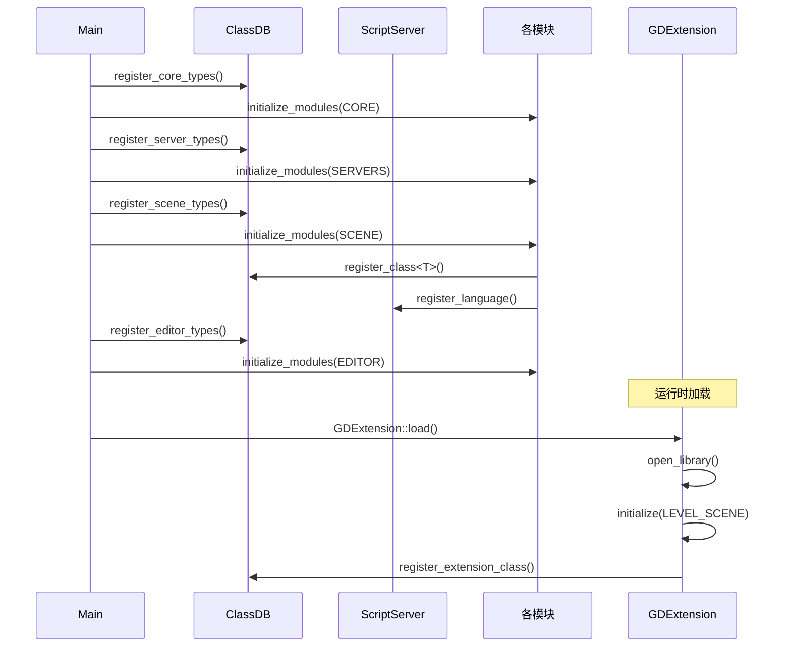

# 07 - Godot 模块系统与扩展机制

> **源码版本**：Godot 4.8.dev（master 分支，2026-08-26）
> **证据等级**：A（除非另行标注）

---

## 1. 模块概述

Godot 的模块系统是其可扩展性的核心。引擎将可选功能（GDScript、C#、导航、WebRTC、GLTF 导入等）组织为独立的 `modules/` 子目录，每个模块通过统一的 `register_types.cpp` 接口接入引擎。这种设计使得引擎核心保持精简，同时允许按需编译——开发者可以禁用不需要的模块以减小二进制体积。

Godot 的扩展机制分为三个层次：**内置模块**（modules/ 目录，编译时集成）、**GDExtension**（运行时动态加载的共享库）、**EditorPlugin**（编辑器插件，纯脚本）。这三层覆盖了从核心引擎扩展到轻量编辑器增强的全部场景。

理解模块系统是理解 Godot 工程组织的关键。它揭示了 Godot 如何在保持核心稳定的同时，通过模块化实现功能扩展。

---

## 2. 关键文件清单

> **证据等级 A**：以下文件均基于实际检出验证。

| 文件 | 行数(约) | 职责 |
|------|----------|------|
| `modules/register_module_types.h` | ~30 | 模块注册入口声明 |
| `modules/register_module_types.cpp` | ~50 | 模块注册入口实现 |
| `modules/gdscript/register_types.cpp` | ~200 | GDScript 模块注册 |
| `modules/gdscript/register_types.h` | ~40 | GDScript 模块注册声明 |
| `modules/mono/register_types.cpp` | ~300 | C# 模块注册 |
| `modules/navigation/register_types.cpp` | ~100 | 导航模块注册 |
| `modules/webrtc/register_types.cpp` | ~80 | WebRTC 模块注册 |
| `modules/gltf/register_types.cpp` | ~150 | GLTF 模块注册 |
| `core/extension/gdextension.h` | ~200 | GDExtension 接口 |
| `core/extension/gdextension.cpp` | ~500 | GDExtension 实现 |
| `editor/plugins/editor_plugin.h` | ~300 | EditorPlugin 基类 |

---

## 3. 核心数据结构

### 3.1 模块初始化的四个级别

> **证据等级 A**：基于 `modules/register_module_types.h` 验证。

```cpp
// modules/register_module_types.h（简化）
enum ModuleInitializationLevel {
    MODULE_INITIALIZATION_LEVEL_CORE = 0,
    MODULE_INITIALIZATION_LEVEL_SERVERS = 1,
    MODULE_INITIALIZATION_LEVEL_SCENE = 2,
    MODULE_INITIALIZATION_LEVEL_EDITOR = 3,
};

void initialize_modules(ModuleInitializationLevel p_level);
void uninitialize_modules(ModuleInitializationLevel p_level);
```

四个级别对应引擎启动的不同阶段：

```
┌─────────────────────────────────────────────────────────────────┐
│                  模块初始化的四个级别                            │
├─────────────────────────────────────────────────────────────────┤
│                                                                 │
│  LEVEL_CORE (最先)                                              │
│  ├── 时机：register_core_types() 之后                           │
│  ├── 可用：Object、Variant、ClassDB、RefCounted                 │
│  ├── 典型模块：无（核心模块通常在 core/ 中）                    │
│  └── 用途：注册最基础的类型                                     │
│                                                                 │
│  LEVEL_SERVERS                                                  │
│  ├── 时机：register_server_types() 之后                         │
│  ├── 可用：所有 Server 抽象（RenderingServer 等）               │
│  ├── 典型模块：自定义物理后端、自定义渲染后端                   │
│  └── 用途：注册服务器实现                                       │
│                                                                 │
│  LEVEL_SCENE                                                    │
│  ├── 时机：register_scene_types() 之后                          │
│  ├── 可用：Node、SceneTree、Resource                            │
│  ├── 典型模块：GDScript、C#、Navigation、WebRTC、GLTF           │
│  └── 用途：注册场景节点、资源、脚本语言                         │
│                                                                 │
│  LEVEL_EDITOR (最后，仅 TOOLS_ENABLED)                          │
│  ├── 时机：register_editor_types() 之后                         │
│  ├── 可用：EditorPlugin、EditorInspectorPlugin 等               │
│  ├── 典型模块：编辑器增强、导入器插件                           │
│  └── 用途：注册编辑器功能                                       │
│                                                                 │
└─────────────────────────────────────────────────────────────────┘
```

### 3.2 模块注册的标准结构

每个模块必须包含 `register_types.h` 和 `register_types.cpp`，实现两个函数：

```cpp
// modules/<module_name>/register_types.h
#pragma once
#include "modules/register_module_types.h"
void initialize_<module_name>_module(ModuleInitializationLevel p_level);
void uninitialize_<module_name>_module(ModuleInitializationLevel p_level);
```

```cpp
// modules/<module_name>/register_types.cpp
#include "register_types.h"
#include "core/object/class_db.h"
// ... 其他 include

void initialize_<module_name>_module(ModuleInitializationLevel p_level) {
    switch (p_level) {
        case MODULE_INITIALIZATION_LEVEL_CORE:
            // 核心级初始化
            break;
        case MODULE_INITIALIZATION_LEVEL_SERVERS:
            // 服务器级初始化
            break;
        case MODULE_INITIALIZATION_LEVEL_SCENE:
            // 场景级初始化
            ClassDB::register_class<MyClass>();
            // 注册脚本语言（若是脚本模块）
            ScriptServer::register_language(&my_language);
            break;
        case MODULE_INITIALIZATION_LEVEL_EDITOR:
            // 编辑器级初始化
            break;
    }
}

void uninitialize_<module_name>_module(ModuleInitializationLevel p_level) {
    switch (p_level) {
        case MODULE_INITIALIZATION_LEVEL_SCENE:
            // 清理场景级资源
            break;
        // ...
    }
}
```

### 3.3 模块编译配置

每个模块通过 `config.py` 或 `SCsub` 文件配置编译：

```python
# modules/<module_name>/config.py
def can_build(env, platform):
    return True  # 所有平台可编译

def configure(env):
    pass  # 配置选项

def get_doc_classes():
    return ["MyClass"]  # 文档类

def get_doc_path():
    return "modules/<module_name>"
```

```python
# modules/<module_name>/SCsub
Import("env")
env.add_source_files(env.modules_sources, "*.cpp")
```

---

## 4. 核心类与职责

### 4.1 GDScript 模块

> **证据等级 A**：基于 `modules/gdscript/register_types.cpp` 验证。

GDScript 是 Godot 的原生脚本语言，作为模块实现：

```cpp
// modules/gdscript/register_types.cpp（简化）
static GDScriptLanguage *script_language_gd = nullptr;
static GDScriptResourceLoader *resource_loader_gd = nullptr;
static GDScriptResourceSaver *resource_saver_gd = nullptr;

void initialize_gdscript_module(ModuleInitializationLevel p_level) {
    if (p_level == MODULE_INITIALIZATION_LEVEL_SCENE) {
        // 创建语言实例
        script_language_gd = memnew(GDScriptLanguage);
        ScriptServer::register_language(script_language_gd);

        // 注册资源加载/保存器
        resource_loader_gd = memnew(GDScriptResourceLoader);
        ResourceLoader::add_resource_format_loader(resource_loader_gd);

        resource_saver_gd = memnew(GDScriptResourceSaver);
        ResourceSaver::add_resource_format_saver(resource_saver_gd);

        // 注册 GDScript 相关类
        GDREGISTER_CLASS(GDScript);
        GDREGISTER_CLASS(GDScriptFunctionState);
        // ...
    }
}

void uninitialize_gdscript_module(ModuleInitializationLevel p_level) {
    if (p_level == MODULE_INITIALIZATION_LEVEL_SCENE) {
        ScriptServer::unregister_language(script_language_gd);
        ResourceLoader::remove_resource_format_loader(resource_loader_gd);
        ResourceSaver::remove_resource_format_saver(resource_saver_gd);

        memdelete(script_language_gd);
        memdelete(resource_loader_gd);
        memdelete(resource_saver_gd);
    }
}
```

#### 4.1.1 GDScriptLanguage 的职责

> **证据等级 A**：基于 `modules/gdscript/gdscript.h` 验证。

```cpp
class GDScriptLanguage : public ScriptLanguage {
public:
    // 脚本创建
    virtual Script *create_script() const override;

    // 脚本实例创建
    virtual ScriptInstance *create_instance(Object *p_this, const Ref<Script> &p_script) override;

    // 源码解析
    virtual Error compile(const String &p_code, const String &p_path) override;

    // 全局常量
    virtual void get_global_constants(List<Pair<String, int>> *p_constants) const override;

    // 调试
    virtual void debug_get_stack_frame_info(...) override;
    // ...
};
```

### 4.2 C# 模块

> **证据等级 A**：基于 `modules/mono/register_types.cpp` 验证。

C# 模块通过 Mono 运行时集成：

```cpp
// modules/mono/register_types.cpp（简化）
void initialize_mono_module(ModuleInitializationLevel p_level) {
    if (p_level == MODULE_INITIALIZATION_LEVEL_SCENE) {
        // 初始化 Mono 运行时
        GDMono::initialize();

        // 注册 C# 脚本语言
        script_language_csharp = memnew(CSharpLanguage);
        ScriptServer::register_language(script_language_csharp);

        // 注册资源加载/保存器
        // ...
    }
}
```

### 4.3 Navigation 模块

> **证据等级 A**：基于 `modules/navigation/register_types.cpp` 验证。

导航模块提供寻路与导航网格：

```cpp
// modules/navigation/register_types.cpp（简化）
void initialize_navigation_module(ModuleInitializationLevel p_level) {
    if (p_level == MODULE_INITIALIZATION_LEVEL_SERVERS) {
        // 注册导航服务器
        NavigationServer3DManager::set_default_server(NavigationServer3DManager::get_default_server_name());
    }
    if (p_level == MODULE_INITIALIZATION_LEVEL_SCENE) {
        // 注册导航相关节点
        GDREGISTER_CLASS(NavigationRegion3D);
        GDREGISTER_CLASS(NavigationAgent3D);
        GDREGISTER_CLASS(NavigationObstacle3D);
        // ...
    }
}
```

### 4.4 GDExtension 系统

> **证据等级 A**：基于 `core/extension/gdextension.h` 验证。

GDExtension 是 Godot 4.x 引入的运行时扩展机制，允许动态加载共享库（.dll/.so/.dylib）：

```cpp
// core/extension/gdextension.h（简化）
class GDExtension : public Resource {
    GDCLASS(GDExtension, Resource);

    void *library = nullptr; // 共享库句柄
    String library_path;
    bool is_initialized = false;

    // 扩展初始化函数
    GDExtensionInitializationFunction initialization_function = nullptr;

public:
    Error open_library(const String &p_path);
    void close_library();

    // 初始化扩展
    Error initialize(InitializationLevel p_level = INITIALIZATION_LEVEL_SCENE);
    void deinitialize(InitializationLevel p_level);

    // 加载扩展类
    static Ref<GDExtension> load(const String &p_path);
};

// 扩展接口（C ABI）
typedef GDExtensionBool (*GDExtensionInitializationFunction)(
    const GDExtensionInterface *p_interface,
    GDExtensionClassLibraryPtr p_library,
    GDExtensionInitialization *r_initialization
);
```

#### 4.4.1 GDExtension 的初始化级别

```cpp
enum InitializationLevel {
    INITIALIZATION_LEVEL_CORE = 0,
    INITIALIZATION_LEVEL_SERVERS = 1,
    INITIALIZATION_LEVEL_SCENE = 2,
    INITIALIZATION_LEVEL_EDITOR = 3,
};
```

与内置模块的四个级别对应。

#### 4.4.2 GDExtension 类注册

```cpp
// 扩展库中注册类
void register_example_class() {
    GDExtensionClassDefinition def = {};
    def.class_name = "ExampleClass";
    def.parent_class = "Node";
    def.create_instance_func = [](void *) -> GDExtensionObjectPtr {
        return memnew(ExampleClass);
    };
    def.free_instance_func = [](void *, GDExtensionObjectPtr p_obj) {
        memdelete((ExampleClass *)p_obj);
    };
    // ... 其他回调
    GDExtensionClassLibrary::register_class(&def);
}
```

### 4.5 EditorPlugin 系统

> **证据等级 A**：基于 `editor/plugins/editor_plugin.h` 验证。

EditorPlugin 是编辑器扩展的脚本接口：

```cpp
// editor/plugins/editor_plugin.h（简化）
class EditorPlugin : public Node {
    GDCLASS(EditorPlugin, Node);

public:
    // 插件生命周期
    virtual void _apply_changes() {}
    virtual void _clear() {}
    virtual bool _build() { return true; }

    // 编辑器集成
    virtual void _edit(Object *p_object) {}
    virtual bool _handles(Object *p_object) const { return false; }
    virtual void _make_visible(bool p_visible) {}

    // 自定义 UI
    virtual void _notification(int p_what) {}

    // 输入处理
    virtual void _forward_canvas_draw_over_viewport(Control *p_overlay) {}
    virtual bool _forward_canvas_gui_input(const Ref<InputEvent> &p_event) { return false; }

    // ...
};
```

#### 4.5.1 EditorPlugin 使用示例

```gdscript
# addons/my_plugin/plugin.cfg
[plugin]
name="My Plugin"
description="A custom plugin"
author="Author"
version="1.0"
script="plugin.gd"

# addons/my_plugin/plugin.gd
@tool
extends EditorPlugin

func _enter_tree():
    # 添加自定义节点类型
    add_custom_type("MyNode", "Node", preload("my_node.gd"), preload("icon.png"))

func _exit_tree():
    remove_custom_type("MyNode")
```

---

## 5. 关键算法与流程

### 5.1 模块编译流程

```
1. scons 命令
   │
   ▼
2. SConstruct 扫描 modules/ 目录
   │   └── 检测每个模块的 config.py
   │       └── can_build(env, platform) 判断是否编译
   │
   ▼
3. 生成 modules_enabled.gen.h
   │   └── #define MODULE_GDSCRIPT_ENABLED
   │       #define MODULE_MONO_ENABLED
   │       ...
   │
   ▼
4. 编译每个模块的 SCsub
   │   └── env.add_source_files(env.modules_sources, "*.cpp")
   │
   ▼
5. 生成 register_module_types.gen.cpp
   │   └── 自动包含所有启用模块的 register_types.h
   │       自动生成 initialize_modules() / uninitialize_modules()
   │
   ▼
6. 链接到 godot 二进制
```

### 5.2 模块注册流程

```
Main::setup()
│
├── register_core_types()
│   └── initialize_modules(MODULE_INITIALIZATION_LEVEL_CORE)
│       └── initialize_<module>_module(CORE)
│           └── 各模块的核心级初始化
│
├── register_server_types()
│   └── initialize_modules(MODULE_INITIALIZATION_LEVEL_SERVERS)
│       └── initialize_<module>_module(SERVERS)
│           └── 各模块的服务器级初始化
│
├── register_scene_types()
│   └── initialize_modules(MODULE_INITIALIZATION_LEVEL_SCENE)
│       └── initialize_<module>_module(SCENE)
│           └── 各模块的场景级初始化
│               ├── ClassDB::register_class<...>()
│               └── ScriptServer::register_language(...)
│
└── register_editor_types()  // 仅 TOOLS_ENABLED
    └── initialize_modules(MODULE_INITIALIZATION_LEVEL_EDITOR)
        └── initialize_<module>_module(EDITOR)
            └── 各模块的编辑器级初始化
```

### 5.3 GDExtension 加载流程

```
1. 项目加载 .gdextension 文件
   │
   ▼
2. GDExtension::load(path)
   ├── 解析 .gdextension 配置
   └── 确定平台对应的库文件
   │
   ▼
3. GDExtension::open_library()
   └── OS::get_singleton()->open_dynamic_library()
   │
   ▼
4. 获取初始化函数符号
   └── OS::get_singleton()->get_dynamic_library_symbol()
   │
   ▼
5. 调用初始化函数
   ├── 传入 GDExtensionInterface（引擎提供的 API 表）
   ├── 扩展库注册类、方法、属性
   └── 返回 GDExtensionInitialization 结构
   │
   ▼
6. 按级别初始化
   ├── initialize(INITIALIZATION_LEVEL_CORE)
   ├── initialize(INITIALIZATION_LEVEL_SERVERS)
   ├── initialize(INITIALIZATION_LEVEL_SCENE)
   └── initialize(INITIALIZATION_LEVEL_EDITOR)
```

### 5.4 脚本语言注册流程

```
1. 模块初始化（SCENE 级别）
   └── ScriptServer::register_language(&my_language)
   │
   ▼
2. 引擎记录语言
   └── ScriptServer::languages.push_back(&my_language)
   │
   ▼
3. 用户加载脚本文件
   └── ResourceLoader::load("script.gd")
   │
   ▼
4. 资源加载器匹配扩展名
   └── GDScriptResourceLoader 识别 .gd
   │
   ▼
5. 创建脚本资源
   └── script_language_gd->create_script()
   │
   ▼
6. 编译脚本
   └── script->reload()
   │
   ▼
7. 脚本附加到对象
   └── object->set_script(script)
   │
   ▼
8. 创建脚本实例
   └── script->create_instance(object)
   │
   ▼
9. 调用脚本方法
   └── object->callp("my_method", ...)
   └── script_instance->callp("my_method", ...)
```

---

## 6. 与其他模块的交互

### 6.1 模块与 ClassDB

```
模块初始化
    │
    ▼
ClassDB::register_class<MyClass>()
    │
    ▼
ClassDB::classes["MyClass"]
    ├── creation_func = &MyClass::create
    ├── method_map = {...}
    ├── property_map = {...}
    └── signal_map = {...}
    │
    ▼
GDScript: var obj = MyClass.new()
    │
    ▼
ClassDB::instantiate("MyClass")
    └── creation_func() → memnew(MyClass)
```

### 6.2 模块与 ScriptServer

```
脚本模块初始化
    │
    ▼
ScriptServer::register_language(&language)
    │
    ▼
ScriptServer::languages = [&gdscript, &csharp, ...]
    │
    ▼
用户加载脚本
    │
    ▼
ResourceLoader 匹配扩展名
    │
    ▼
对应语言的 create_script()
```

### 6.3 模块与 ResourceLoader

```
模块初始化
    │
    ▼
ResourceLoader::add_resource_format_loader(loader)
    │
    ▼
ResourceLoader::loader = [gd_loader, gltf_loader, ...]
    │
    ▼
用户加载资源
    │
    ▼
ResourceLoader::load("file.gd")
    │
    ▼
遍历 loader，匹配扩展名
    │
    ▼
GDScriptResourceLoader::load("file.gd")
```

### 6.4 GDExtension 与 ClassDB

```
GDExtension 加载
    │
    ▼
扩展库注册类
    │
    ▼
ClassDB::register_extension_class(...)
    │
    ▼
ClassDB::classes["ExtensionClass"]
    ├── creation_func = 扩展库提供的回调
    └── method_map = {扩展库注册的方法}
    │
    ▼
GDScript: var obj = ExtensionClass.new()
    │
    ▼
ClassDB::instantiate("ExtensionClass")
    └── 扩展库的 create_instance_func()
```

---

## 7. 内存与生命周期

### 7.1 模块单例生命周期

```
initialize_<module>_module(SCENE)
    └── memnew(ModuleSingleton)
    │
    ▼
运行期间
    └── ModuleSingleton 持续运行
    │
    ▼
uninitialize_<module>_module(SCENE)
    └── memdelete(ModuleSingleton)
```

### 7.2 脚本语言生命周期

```
initialize_gdscript_module(SCENE)
    ├── memnew(GDScriptLanguage)
    └── ScriptServer::register_language()
    │
    ▼
运行期间
    ├── GDScriptLanguage 管理所有脚本
    └── 编译、缓存脚本
    │
    ▼
uninitialize_gdscript_module(SCENE)
    ├── ScriptServer::unregister_language()
    └── memdelete(GDScriptLanguage)
```

### 7.3 GDExtension 生命周期

```
项目加载
    └── GDExtension::load()
    │
    ▼
initialize(LEVEL_SCENE)
    └── 扩展库注册类
    │
    ▼
运行期间
    └── 扩展类实例正常使用
    │
    ▼
项目卸载
    └── deinitialize(LEVEL_SCENE)
    └── GDExtension::close_library()
```

---

## 8. 线程模型

### 8.1 模块初始化的线程安全

- 模块初始化在主线程执行
- ClassDB 注册使用锁保护
- ScriptServer 注册使用锁保护

### 8.2 脚本执行的线程安全

- GDScript 默认在主线程执行
- C# 默认在主线程执行
- 可通过 `WorkerThreadPool` 在子线程执行任务

### 8.3 GDExtension 的线程安全

- 扩展库需自行处理线程安全
- 引擎提供的 GDExtensionInterface 是线程安全的
- 扩展类的方法调用在调用方线程执行

---

## 9. 错误处理与日志

### 9.1 模块加载错误

```cpp
// 模块初始化失败
if (!script_language_gd) {
    ERR_PRINT("Failed to initialize GDScript language");
    return;
}
```

### 9.2 GDExtension 加载错误

```cpp
Error GDExtension::open_library(const String &p_path) {
    Error err = OS::get_singleton()->open_dynamic_library(p_path, library);
    if (err != OK) {
        ERR_PRINT("Failed to load GDExtension library: " + p_path);
        return err;
    }
    return OK;
}
```

### 9.3 脚本编译错误

- GDScript 编译错误通过 `GDScriptLanguage::debug_get_errors()` 获取
- C# 编译错误通过 Mono 运行时获取
- 错误显示在编辑器的"输出"面板

---

## 10. 配置与可扩展性

### 10.1 启用/禁用模块

```bash
# 编译时禁用模块
scons module_mono_enabled=no
scons module_webrtc_enabled=no
```

### 10.2 自定义模块

在 `modules/` 下创建新模块：

```
modules/my_module/
├── config.py          # 模块配置
├── SCsub              # 编译配置
├── register_types.h   # 注册声明
├── register_types.cpp # 注册实现
├── my_class.h         # 类声明
└── my_class.cpp       # 类实现
```

```python
# modules/my_module/config.py
def can_build(env, platform):
    return True

def configure(env):
    pass
```

```python
# modules/my_module/SCsub
Import("env")
env.add_source_files(env.modules_sources, "*.cpp")
```

```cpp
// modules/my_module/register_types.cpp
#include "register_types.h"
#include "core/object/class_db.h"
#include "my_class.h"

void initialize_my_module_module(ModuleInitializationLevel p_level) {
    if (p_level == MODULE_INITIALIZATION_LEVEL_SCENE) {
        ClassDB::register_class<MyClass>();
    }
}

void uninitialize_my_module_module(ModuleInitializationLevel p_level) {
    if (p_level == MODULE_INITIALIZATION_LEVEL_SCENE) {
        // 清理
    }
}
```

### 10.3 GDExtension 配置

```ini
# my_extension.gdextension
[configuration]
entry_symbol = "my_extension_init"
compatibility_minimum = 4.2

[libraries]
macos.debug = "res://bin/macos/libmy_extension.macos.debug.dylib"
macos.release = "res://bin/macos/libmy_extension.macos.release.dylib"
windows.debug.x86_64 = "res://bin/windows/libmy_extension.windows.debug.x86_64.dll"
windows.release.x86_64 = "res://bin/windows/libmy_extension.windows.release.x86_64.dll"
linux.debug.x86_64 = "res://bin/linux/libmy_extension.linux.debug.x86_64.so"
linux.release.x86_64 = "res://bin/linux/libmy_extension.linux.release.x86_64.so"
```

---

## 11. 性能考量

### 11.1 模块编译优化

- **按需编译**：禁用不用的模块减小体积
- **LTO**：链接时优化提升性能
- **调试符号**：dev_build 启用，便于调试

### 11.2 脚本性能

- **GDScript**：解释执行，约 C++ 的 1/10 速度
- **C#**：JIT 编译，接近 C++ 速度
- **GDExtension**：原生 C++，无性能损失

### 11.3 GDExtension 调用开销

- 每次跨边界调用有少量开销（参数转换）
- 频繁调用的小函数建议内联到扩展库
- 批量操作减少调用次数

### 11.4 类注册开销

- ClassDB 注册在启动时一次性完成
- 运行时无注册开销
- 类查找使用 StringName，O(1)

---

## 12. 调试技巧

### 12.1 模块调试

- 在 `initialize_<module>_module` 添加日志
- 使用 `--verbose` 查看启动日志
- `--check-only` 验证模块加载

### 12.2 脚本调试

- 编辑器内置调试器
- `print()` / `push_error()` / `push_warning()`
- 断点、单步、变量查看

### 12.3 GDExtension 调试

- 在扩展库中添加日志
- 使用平台调试器（gdb/lldb/Visual Studio）
- `--verbose` 查看加载日志

### 12.4 类注册检查

```gdscript
# 列出所有注册的类
print(ClassDB::get_class_list())

# 检查类是否存在
print(ClassDB::class_exists("MyClass"))

# 检查继承关系
print(ClassDB::is_parent_class("MyClass", "Node"))
```

---

## 13. 常见陷阱

### 13.1 模块初始化顺序

- 模块初始化按级别顺序：CORE → SERVERS → SCENE → EDITOR
- 不能在低级别使用高级别的类
- 例如：CORE 级别不能使用 Node（SCENE 级别才注册）

### 13.2 脚本语言冲突

- 多个脚本语言可能注册同名类
- 使用命名空间或前缀避免冲突

### 13.3 GDExtension ABI 兼容

- GDExtension 与引擎版本绑定
- 升级引擎可能需要重新编译扩展
- 使用 `compatibility_minimum` 声明兼容版本

### 13.4 循环依赖

- 模块 A 依赖模块 B，模块 B 依赖模块 A
- 通过接口抽象打破循环
- 或将公共部分提取到 core/

### 13.5 资源加载器冲突

- 多个加载器匹配同一扩展名
- 后注册的优先级高
- 使用唯一扩展名避免冲突

### 13.6 编辑器插件未启用 @tool

- 编辑器插件必须加 `@tool` 注解
- 否则无法在编辑器中运行

---

## 14. 源码阅读建议

### 14.1 推荐阅读顺序

1. **模块注册入口**：`modules/register_module_types.h`、`modules/register_module_types.cpp`
2. **简单模块**：`modules/navigation/register_types.cpp`
3. **脚本模块**：`modules/gdscript/register_types.cpp`
4. **GDExtension**：`core/extension/gdextension.h`、`core/extension/gdextension.cpp`
5. **EditorPlugin**：`editor/plugins/editor_plugin.h`

### 14.2 实践建议

- 创建一个简单的自定义模块
- 注册一个自定义类，从 GDScript 调用
- 创建一个 GDExtension，加载到项目中
- 编写一个 EditorPlugin，添加自定义节点

### 14.3 关键搜索

```bash
# 查找所有模块的 register_types
find modules/ -name "register_types.cpp"

# 查找模块初始化级别使用
grep -r "MODULE_INITIALIZATION_LEVEL" modules/

# 查找 GDExtension 类注册
grep -r "register_extension_class" core/extension/
```

---

## 15. 参考与延伸

### 15.1 关键源码索引

| 主题 | 文件 |
|------|------|
| 模块注册入口 | `modules/register_module_types.h`、`modules/register_module_types.cpp` |
| GDScript 模块 | `modules/gdscript/register_types.cpp` |
| C# 模块 | `modules/mono/register_types.cpp` |
| Navigation 模块 | `modules/navigation/register_types.cpp` |
| GDExtension | `core/extension/gdextension.h`、`core/extension/gdextension.cpp` |
| EditorPlugin | `editor/plugins/editor_plugin.h` |
| ScriptServer | `core/object/script_language.h` |
| ClassDB | `core/object/class_db.h` |

### 15.2 相关文档

- [01-总体架构.md](./01-总体架构.md)：modules/ 在整体架构中的位置
- [02-核心概念.md](./02-核心概念.md)：ClassDB 注册机制
- [03-启动流程.md](./03-启动流程.md)：模块初始化顺序
- [06-C++技术分析.md](./06-C++技术分析.md)：GDCLASS 宏

### 15.3 模块系统架构图

```
┌─────────────────────────────────────────────────────────────────┐
│                      Godot 扩展体系                              │
├─────────────────────────────────────────────────────────────────┤
│                                                                 │
│  内置模块（modules/）                                            │
│  ┌─────────────────────────────────────────────────────────┐   │
│  │  GDScript  │  C#  │  Navigation  │  WebRTC  │  GLTF  │   │   │
│  │  编译时集成，最高性能，可访问全部引擎内部 API                │   │
│  └─────────────────────────────────────────────────────────┘   │
│                          │                                      │
│                          │ register_types.cpp                   │
│                          ▼                                      │
│  ┌─────────────────────────────────────────────────────────┐   │
│  │              ClassDB / ScriptServer                      │   │
│  │  register_class<T>() / register_language()               │   │
│  └─────────────────────────────────────────────────────────┘   │
│                                                                 │
│  GDExtension（运行时扩展）                                       │
│  ┌─────────────────────────────────────────────────────────┐   │
│  │  动态加载 .dll/.so/.dylib                                │   │
│  │  通过 C ABI 接口与引擎交互                                │   │
│  │  跨语言（C++/Rust/Go/Zig）支持                            │   │
│  │  无需重新编译引擎                                         │   │
│  └─────────────────────────────────────────────────────────┘   │
│                          │                                      │
│                          │ GDExtensionInterface                 │
│                          ▼                                      │
│  ┌─────────────────────────────────────────────────────────┐   │
│  │              ClassDB（扩展类注册）                        │   │
│  │  register_extension_class()                              │   │
│  └─────────────────────────────────────────────────────────┘   │
│                                                                 │
│  EditorPlugin（编辑器插件）                                      │
│  ┌─────────────────────────────────────────────────────────┐   │
│  │  纯脚本（GDScript/C#）                                    │   │
│  │  仅编辑器环境                                             │   │
│  │  添加自定义节点、面板、工具                                │   │
│  │  通过 addons/ 目录组织                                    │   │
│  └─────────────────────────────────────────────────────────┘   │
│                                                                 │
└─────────────────────────────────────────────────────────────────┘
```

### 15.4 模块初始化时序图


